<h1 align="center">👋 Olá, eu sou Leandro Vinicius</h1>

  Desenvolvedor Full Stack Sênior • Arquitetura de Sistemas • Produtos B2B

  

---

## 🚀 Sobre mim
Sou **Desenvolvedor Full Stack Sênior**, com forte atuação em **sistemas corporativos, ERPs e plataformas B2B**.  
Tenho experiência sólida em **modernização de sistemas legados**, arquitetura de back-end escalável e produtos voltados para operação, financeiro e gestão.

- 🧠 Especialista em **NestJS, Next.js, TypeScript e Prisma**
- 🏗️ Migração de legado **PHP/CodeIgniter → Stack moderna**
- 🔌 Infraestrutura, deploy, bancos, e-mail transacional e APIs
- 📊 Dashboards e indicadores com **Power BI**
- 💼 Experiência real com **negócios em produção**

---

## 🧰 Stack Principal

  
  
  
  
  
  
  
  
  

---

## 📌 Principais projetos / áreas
- 🚗 **Locação & ERP (KL Rent a Car)**  
  Wizard de locação, financeiro, estoque, boletos, remessas e relatórios

- 🍽️ **Operação & Satisfação (V.V. Refeições)**  
  Pesquisa de satisfação, dashboards, integrações e infraestrutura

- 💆 **Primata Estética**  
  Plataforma completa com **NestJS + Prisma** e front desktop (**React + Tauri**)

---

## 📈 GitHub Stats
<!-- 

  

 -->

  
  

---

## 🤝 Contato & Redes

  
  

